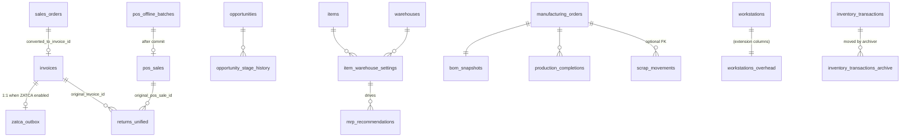

# Phase 1 Data Model: Sales/POS/CRM/ZATCA + Inventory/Costing/Manufacturing Remediation

**Feature**: 023-sales-inventory-trade-integrity
**Date**: 2026-05-02
**Scope rule**: Tables, critical fields, relationships, validations, and state diagrams only. **No DDL.** DDL is produced by the migrations listed in `plan.md` and is mirrored into `backend/db_ddl/tenant_schema.py` and `backend/database.py` per Constitution Principle XXVIII (Schema Sync).

All tables include `tenant_id`, `created_at`, `updated_at`, `created_by`, `updated_by`, and a `deleted_at NULL` soft-delete column unless explicitly stated otherwise. All monetary fields are `NUMERIC(18,4)`; quantities are `NUMERIC(18,4)` (or `NUMERIC(18,6)` where finer precision is required, marked `[fine]`).

---

## 1. Extensions to existing tables

### `sales_orders` — extended

| Column | Type | Notes |
|--------|------|-------|
| `converted_to_invoice_id` | `BIGINT NULL` | FK → `invoices.id`. **Unique partial index** when `NOT NULL` — exactly-one conversion. |
| `responsible_user_id` | `BIGINT NULL` | FK → `users.id`. Used by commission tracking (calc deferred). |

**Validations**:
- `converted_to_invoice_id` may only be set when `state = 'confirmed'`.
- A second concurrent attempt to set it raises a `UniqueViolation` that the Order→Invoice service catches and translates to an idempotent read.

### `invoices` — extended

| Column | Type | Notes |
|--------|------|-------|
| `state` | `VARCHAR(32) NOT NULL DEFAULT 'draft'` | Enum-like; allowed values `draft, posted, submitted, cleared, reported, reversed, cancelled`. CHECK constraint enforces the set. |
| `idempotency_key` | `VARCHAR(64) NULL` | Unique within `(tenant_id, sales_order_id, idempotency_key)` when not null. |
| `posted_at` | `TIMESTAMPTZ NULL` | Set by the state machine on `draft → posted`. |
| `posted_by` | `BIGINT NULL` | FK → `users.id`; set by the state machine. |
| `state_reason` | `TEXT NULL` | Optional reason captured for `reversed`, `cancelled`. |

**State diagram**:

```
draft ──post──▶ posted ──submit──▶ submitted ──clear──▶ cleared
                                              └─report──▶ reported
                                                                 │
draft ──cancel──▶ cancelled                                      │
posted ──cancel──▶ cancelled                                     │
posted ──reverse──▶ reversed ◀──reverse──┬─cleared, reported────┘
```

`(tenant_id, idempotency_key, sales_order_id)` is unique when `idempotency_key NOT NULL`.

### `manufacturing_orders` — extended

| Column | Type | Notes |
|--------|------|-------|
| `bom_snapshot_id` | `BIGINT NULL` | FK → `bom_snapshots.id`. Set when MO is released. |
| `remaining_qty` | `NUMERIC(18,4)` | Decremented by each completion; `0` ⇒ fully completed. |
| `qc_required` | `BOOLEAN DEFAULT FALSE` | Drives the QC gate. |
| `state` | `VARCHAR(32)` | Extended enum: `planned, pending_approval, released, in_progress, qc_pending, completed, cancelled`. |
| `requires_approval` | `BOOLEAN DEFAULT FALSE` | Set automatically when planned cost ≥ `manufacturing.large_mo_threshold`. |
| `approved_by` | `BIGINT NULL` | FK → `users.id`. |
| `approved_at` | `TIMESTAMPTZ NULL` | |

**MO state diagram**:

```
planned ──[≥large_mo_threshold]──▶ pending_approval ──approve──▶ released
planned ──[<threshold]────────────────────────────────────────▶ released
released ──start──▶ in_progress
in_progress ──complete (qty < remaining)──▶ in_progress
in_progress ──complete (qty = remaining, qc_required=false)──▶ completed
in_progress ──complete (qc_required=true)──▶ qc_pending
qc_pending ──pass──▶ completed
qc_pending ──fail──▶ in_progress (rework) | completed (scrap)
any non-terminal ──cancel──▶ cancelled
```

### `workstations` — extended

| Column | Type | Notes |
|--------|------|-------|
| `overhead_rate` | `NUMERIC(18,4) NULL` | Per-minute overhead rate. Falls back to `manufacturing.global_overhead_rate` when null. |
| `effective_from` | `DATE NULL` | Allows future-dated rate changes. |
| `effective_to` | `DATE NULL` | NULL = open-ended. |

### `acc_map_sales` — consolidated

Adds `direction VARCHAR(16) NOT NULL DEFAULT 'forward'` (`forward | reversal`). Existing `acc_map_sales_rev` rows are migrated into `acc_map_sales` with `direction='reversal'`. A view `acc_map_sales_rev` filters `direction='reversal'` for backward compatibility during the cleanup window.

---

## 2. New tables

### `zatca_outbox`

| Column | Type | Notes |
|--------|------|-------|
| `id` | `BIGSERIAL PK` | |
| `tenant_id` | `BIGINT NOT NULL` | |
| `invoice_id` | `BIGINT NOT NULL` | FK → `invoices.id`. Unique with `tenant_id`. |
| `state` | `VARCHAR(20) NOT NULL DEFAULT 'pending'` | `pending, submitting, submitted, cleared, reported, failed, dead_letter`. |
| `attempts` | `INT NOT NULL DEFAULT 0` | |
| `next_attempt_at` | `TIMESTAMPTZ NOT NULL` | Driven by exponential backoff. |
| `last_error` | `TEXT NULL` | Sanitized via 022's sanitizer. |
| `idempotency_key` | `VARCHAR(64)` | Used as ZATCA UUID. |
| `signed_xml` | `TEXT NULL` | Cached after successful signing. |
| `cleared_reference` | `VARCHAR(64) NULL` | ZATCA cleared invoice reference. |
| `reported_reference` | `VARCHAR(64) NULL` | ZATCA reported invoice reference. |
| `submitted_at` | `TIMESTAMPTZ NULL` | |
| `acknowledged_at` | `TIMESTAMPTZ NULL` | |

**Indices**: `(tenant_id, state, next_attempt_at)` partial where `state IN ('pending','failed')`; `(tenant_id, invoice_id)` unique.

**Outbox state diagram**:

```
pending ──claim──▶ submitting ──ok──▶ submitted ──ack:cleared──▶ cleared
                                              └─ack:reported──▶ reported
submitting ──error (retryable)──▶ failed (attempts++) ──backoff──▶ pending
failed (attempts ≥ max) ──▶ dead_letter
```

### `returns_unified`

| Column | Type | Notes |
|--------|------|-------|
| `id` | `BIGSERIAL PK` | |
| `tenant_id` | `BIGINT NOT NULL` | |
| `source` | `VARCHAR(16) NOT NULL` | `'sales' | 'pos'`. |
| `original_invoice_id` | `BIGINT NULL` | FK; nullable when source is a non-invoiced POS sale. |
| `original_pos_sale_id` | `BIGINT NULL` | FK; nullable when source is a sales return. |
| `state` | `VARCHAR(20) NOT NULL DEFAULT 'draft'` | `draft, posted, cancelled`. |
| `restock_warehouse_id` | `BIGINT NULL` | When restocking; null when scrap-on-return. |
| `je_id` | `BIGINT NULL` | FK → `journal_entries.id`. Set on post. |
| `total_amount` | `NUMERIC(18,4) NOT NULL DEFAULT 0` | |

Plus a child `returns_unified_lines(return_id, line_no, item_id, qty, unit_price, tax_id)`.

**Compatibility**: `sales_returns` and `pos_returns` become updatable views over `returns_unified` filtered by `source` for the deprecation window.

### `opportunity_stage_history`

| Column | Type | Notes |
|--------|------|-------|
| `id` | `BIGSERIAL PK` | |
| `opportunity_id` | `BIGINT NOT NULL` | FK → `opportunities.id`. |
| `from_stage` | `VARCHAR(32) NULL` | Null on creation. |
| `to_stage` | `VARCHAR(32) NOT NULL` | |
| `entered_at` | `TIMESTAMPTZ NOT NULL` | |
| `actor_id` | `BIGINT NULL` | FK → `users.id`. |
| `reason` | `TEXT NULL` | |

**Index**: `(tenant_id, opportunity_id, entered_at)` and `(tenant_id, to_stage, entered_at)` for funnel.

### `pos_offline_batches`

| Column | Type | Notes |
|--------|------|-------|
| `id` | `BIGSERIAL PK` | |
| `tenant_id` | `BIGINT NOT NULL` | |
| `device_id` | `VARCHAR(64) NOT NULL` | |
| `client_uuid` | `UUID NOT NULL` | |
| `state` | `VARCHAR(20) NOT NULL DEFAULT 'queued'` | `queued, reconciling, committed, manual_review, failed`. |
| `payload` | `JSONB NOT NULL` | The captured offline sale (lines, payments, taxes). |
| `pos_sale_id` | `BIGINT NULL` | FK after a successful commit. |
| `failure_reason_code` | `VARCHAR(32) NULL` | `out_of_stock, closed_period, state_machine_violation, pricing_mismatch, ...` |
| `failure_detail` | `TEXT NULL` | |
| `queued_at` | `TIMESTAMPTZ NOT NULL` | |
| `processed_at` | `TIMESTAMPTZ NULL` | |

**Unique**: `(tenant_id, device_id, client_uuid)`.

**Batch state diagram**:

```
queued ──claim──▶ reconciling ──ok──▶ committed
                              ├─soft fail──▶ manual_review
                              └─hard fail──▶ failed
```

### `item_warehouse_settings`

| Column | Type | Notes |
|--------|------|-------|
| `item_id` | `BIGINT NOT NULL` | FK. |
| `warehouse_id` | `BIGINT NOT NULL` | FK. |
| `reorder_point` | `NUMERIC(18,4)` | |
| `reorder_quantity` | `NUMERIC(18,4)` | |
| `safety_stock` | `NUMERIC(18,4)` | |
| `lead_time_days` | `INT` | |
| `preferred_supplier_id` | `BIGINT NULL` | FK → `suppliers.id`. |

**PK**: `(tenant_id, item_id, warehouse_id)`.

### `mrp_recommendations`

| Column | Type | Notes |
|--------|------|-------|
| `id` | `BIGSERIAL PK` | |
| `run_id` | `UUID NOT NULL` | Groups one MRP run. |
| `item_id` | `BIGINT NOT NULL` | |
| `warehouse_id` | `BIGINT NOT NULL` | |
| `recommended_qty` | `NUMERIC(18,4)` | |
| `due_date` | `DATE` | |
| `supplier_id` | `BIGINT NULL` | |
| `state` | `VARCHAR(20) NOT NULL DEFAULT 'open'` | `open, accepted, dismissed, converted_to_po`. |
| `po_id` | `BIGINT NULL` | FK → `purchase_orders.id` when converted. |
| `reason` | `TEXT` | Human-readable derivation summary. |

### `bom_snapshots`

| Column | Type | Notes |
|--------|------|-------|
| `id` | `BIGSERIAL PK` | |
| `mo_id` | `BIGINT NOT NULL UNIQUE` | One snapshot per MO. |
| `bom_id` | `BIGINT NOT NULL` | FK to source BOM. |
| `bom_version` | `INT NOT NULL` | Captured from source. |
| `payload` | `JSONB NOT NULL` | Frozen lines (item, qty per unit, scrap %, yield, by-products). |
| `created_at` | `TIMESTAMPTZ NOT NULL` | |

### `production_completions`

| Column | Type | Notes |
|--------|------|-------|
| `id` | `BIGSERIAL PK` | |
| `mo_id` | `BIGINT NOT NULL` | FK. |
| `qty` | `NUMERIC(18,4) NOT NULL` | Completion qty. |
| `actual_material_cost` | `NUMERIC(18,4)` | Sum across consumed lines. |
| `actual_labor_cost` | `NUMERIC(18,4)` | |
| `actual_overhead_cost` | `NUMERIC(18,4)` | |
| `byproduct_allocation_method` | `VARCHAR(20)` | `by_sales_value, by_quantity, fixed`. |
| `wip_to_fg_je_id` | `BIGINT NOT NULL` | FK → `journal_entries.id`. |
| `qc_state` | `VARCHAR(20) NULL` | `pending, passed, failed, n/a`. |
| `completed_at` | `TIMESTAMPTZ NOT NULL` | |

### `scrap_movements`

| Column | Type | Notes |
|--------|------|-------|
| `id` | `BIGSERIAL PK` | |
| `item_id` | `BIGINT NOT NULL` | |
| `warehouse_id` | `BIGINT NOT NULL` | |
| `qty` | `NUMERIC(18,4) NOT NULL` | |
| `unit_cost_at_scrap` | `NUMERIC(18,4) NOT NULL` | Snapshot of WAC at scrap time. |
| `reason` | `VARCHAR(64) NOT NULL` | `mo_loss, qc_fail, expiry, damage, other`. |
| `mo_id` | `BIGINT NULL` | FK when scrap originates from an MO. |
| `je_id` | `BIGINT NOT NULL` | FK → `journal_entries.id`. |
| `occurred_at` | `TIMESTAMPTZ NOT NULL` | |

### `inventory_transactions_archive`

Mirrors `inventory_transactions` schema 1:1, with the same indices that the live table has for the spanning queries. Archiver moves rows older than `inventory.retention_days` in batches.

---

## 3. Settings keys (added to `company_settings`)

| Key | Default | Notes |
|-----|---------|-------|
| `pos.lock_ttl_seconds` | `5` | POS Redis lock TTL. |
| `pos.offline_batch_max_age_hours` | `72` | After which a stale batch routes straight to `manual_review`. |
| `zatca.outbox_max_attempts` | `8` | |
| `zatca.outbox_backoff_base_seconds` | `30` | |
| `zatca.outbox_backoff_cap_seconds` | `1800` | |
| `zatca.profile` | `'standard'` | `standard` or `simplified`. |
| `inventory.retention_days` | `365` | Archiver horizon. |
| `inventory.low_stock_debounce_hours` | `36` | Redis dedupe TTL. |
| `inventory.auto_reorder_enabled` | `false` | When true, auto-reorder creates draft POs. |
| `manufacturing.large_mo_threshold` | `100000.0000` | Triggers approval. |
| `manufacturing.yield_tolerance` | `0.05` | 5%. |
| `manufacturing.missing_mapping_policy` | `'warn'` | `warn` or `block`. |
| `manufacturing.global_overhead_rate` | `0.0000` | Fallback per-minute rate. |
| `manufacturing.qc_required_default` | `false` | |
| `crm.velocity_window_days` | `90` | Rolling window. |
| `crm.funnel_window_days` | `90` | Rolling window. |
| `crm.cashflow_horizon_days` | `180` | |
| `mrp.horizon_days` | `60` | |

All keys are read through the existing `settings_service` (no parallel store).

---

## 4. Validation rules summary

- Order→Invoice: `SalesOrder.state == 'confirmed'` AND `converted_to_invoice_id IS NULL` AND idempotency-key uniqueness.
- Invoice state writes: only via `services/sales/invoice_state.py` (CI lint enforced).
- Cancel/return: full-line inventory pre-flight; reversal JE must use `(source, source_id)`.
- POS commit: must hold the per-warehouse stock lock (or fallback advisory lock); CI lint enforces lock helper presence.
- ZATCA outbox: every posted invoice has exactly one `zatca_outbox` row when ZATCA is enabled for that tenant.
- WAC: every cost-affecting movement goes through `services/inventory/wac_per_warehouse.py`.
- MRP: cycle detection is mandatory; on cycle return `BomCycleError` with the cycle path.
- Production completion: `Σ production_completions.qty == manufacturing_orders.original_qty - cancelled_qty` when MO reaches `completed`.
- Scrap: every scrap row has a JE; CI lint forbids ad-hoc inventory `DELETE` statements outside `scrap_movements` writer and archival.
- Archival: archiver is the only writer to `inventory_transactions_archive`.

---

## 5. Relationship overview (Mermaid)



---

## 6. Backwards-compatibility surface

- `acc_map_sales_rev` view → `acc_map_sales WHERE direction='reversal'`.
- `sales_returns` view → `returns_unified WHERE source='sales'`.
- `pos_returns` view → `returns_unified WHERE source='pos'`.
- `/transfer` endpoint returns 410 with a moved-to body. `/transfers` is canonical.

These views/views-of-views remain for one minor release after this feature ships, then are dropped by a follow-up cleanup feature (out of scope here).
